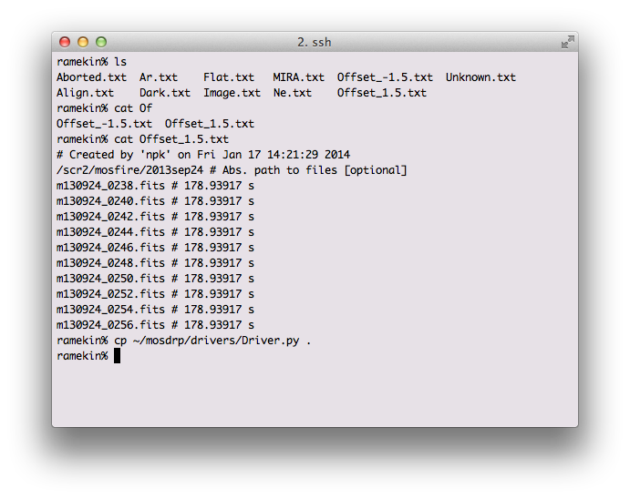

Now that you have data to reduce, we need to set up the pipeline with the appropriate files so that the drp knows what files to use in the reduction. The handle step will parses the FITS header information and determine what files are associated with each of your masks. Because the DRP no longer has a designated output directory, you will need to run handle in your designated reduction sub-directory (REDUX in our example).

Steps to perform:

    cd ~/MOSFIRE/DRP_CODE/REDUX # Go to your output directory
    mospy handle /home/yourhomedir/MOSFIRE/DRP_CODE/2014may08*fits

    
A lot of data summarizing the observations is output. This includes a table of the observations:

    m130514_0132        Flat:mos Y mosmaskA     16.0 s      mosmaskA   Y      YJ
    m130114_0133        Flat:mos Y mosmaskA     16.0 s      mosmaskA   Y      YJ
    m130114_0134        Flat:mos Y mosmaskA     16.0 s      mosmaskA   Y      YJ
    m130114_0135        Flat:mos Y mosmaskA     16.0 s      mosmaskA   Y      YJ
    m130114_0136        Flat:mos Y mosmaskA     16.0 s      mosmaskA   Y      YJ
    m140114_0137        Flat:mos Y mosmaskA     16.0 s      mosmaskA   Y      YJ
    ...

and file lists that organize the observation types:

    mosmaskA /2013jan14/Y/Unknown.txt
    mosmaskA /2013jan14/Y/Align.txt
    mosmaskA /2013jan14/Y/MIRA.txt
    mosmaskA /2013jan14/Y/Ne.txt
    mosmaskA /2013jan14/Y/Offset_2.txt
    mosmaskA /2013jan14/Y/Offset_-2.txt
    mosmaskA /2013jan14/Y/Flat.txt
    mosmaskA /2013jan14/Y/Image.txt
    mosmaskA /2013jan14/Y/FlatThermal.txt
    mosmaskA /2013jan14/Y/Dark.txt
    mosmaskA /2013jan14/Y/Ar.txt
    mosmaskA 2013jan14/Y/Aborted.txt
    ...

The handle step creates a set of directories organized as

    [maskname]/[date]/[band]/

Containing

* Aborted.txt: Aborted files
* Align.txt: Alignment frames
* Ar.txt: Argon spectra
* Dark.txt: Darks 
* Flat.txt: Flat fields
* FlatThermal.txt: Thermal Flats (lamps off)
* Image.txt: Imaging mode
* MIRA.txt: MIRA focus images
* Ne.txt: Neon lamp spectra
* Unknown.txt: Unknown files
* Offset_[p].txt: Science frames

The output directory structure is designed to make finding reduced data easy, and to separate reductions of the same mask across multiple dates. Below is a screen shot showing the example output from an Offset*.txt file.

For longslit observations, separate offsets files are created for each object, but the same offset files are used if the same object is observed many times during the night. You might want to separate the different observations of the same object.

For long2pos observations, again different offset files are created for each object. Besides, the suffixes _PosA and _PosC are added to the offset files to identify the two left and right positions used in the observations.

The following section describes in details how to use the driver file to control the pipeline processes, and points at a number of standard driver files that we provide for reference.

