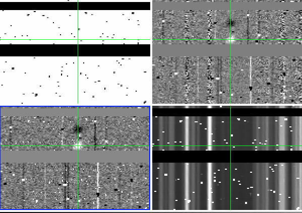

This DRP assumes that targets are nodded along the slit with integration times as described on the instrument web page. The integration times described were selected such that the shot-noise in the region between night sky lines is over 5x larger than the read noise of a 16-fowler sample. For MOSFIRE, we define this as background limited.

Despite MOSFIRE’s (unprescedented) f/2.0 camera, the desired integration time for background-limited operation is longer than the time for the atmosphere to vary by several percent. As a result, a further background subtraction step is required to remove the residual features. The step is performed by a function called background_subtract_helper() and follows the notation and procedure outlined in Kasen (2003; PASP 115). For most users, you’ll want to use the standard Driver file and not worry about the details. 

In the Driver.py file you want to uncomment the following:

    Background.handle_background(obsfiles, 'lambda_solution_wave_stack_J_m130114_0443-0445.fits', maskname, band, waveops)

The lambda_solution_wave_stack file needs to be updated in your driver file. If reducing Kband, be sure to use the merged wave_stack solution. It is one of the outputs from the last wavelength step (see section 8).

In this step:

* Apply the flat field corrections 
* A position files are combined (Offset_*.txt)
* B postion files are combined (Offset_-*.txt)
* Subtract A-B
* Correct for small differences in the background sky emission

## Output Files

The background subtraction step produces the following files. As usual elements in [brackets] are replaced with the value for that mask.

| Filename                         | Content (units)                                                             |
|----------------------------------|-----------------------------------------------------------------------------|
| `eps_Offset_[###].txt.fits` | Average signal in the ### stack ()            |
| `var_Offset_[###].txt.fits` | Total variance in each pixel of above file () |
| `itimes_Offset_[###].txt.fits` | Total exposure time in each pixel of above files () |
| `sub_[maskname] _[bandname]_[plan].fits` | Difference (but non background subtracted) file () |
| `bsub_[maskname]_{ bandname]_[plan].fits` | Background subtracted signal () |
| `bmod_[maskname]_{ bandname]_[plan].fits` | Background model signal () |
| `var_[maskname]_{ bandname]_[plan].fits` | Total variance |
| `itime_[maskname]_{ bandname]_[plan].fits` | Average integration time |

There is redundant information in the above set of files. For instance:

    sub_Mask_K_A-B.fits = eps_Offset_1.5.txt.fits – eps_Offset_-1.5.txt.fits
    var_Mask_K_A-B.fits = var_Offset_1.5.txt.fits + var_Offset_1.5.txt.fits
    itime_Mask_K_A-B.fits = mean(itime_Offset_1.5.txt.fits, itime_Offset_1.5.t.xt.fits)

If you want to drill further into how these are constructed, examine the Background.py imcombine and handle_background functions.

Recitified outputs are also computed as tabulated in the table below.

| Filename                         | Content (units)                                                             |
|----------------------------------|-----------------------------------------------------------------------------|
| `[maskname]_rectified_[bandname]_[plan].fits` | Signal () |
| `[maskname]_rectified_itime_[bandname]_[plan].fits` | Integration time  |
| `[maskname]_rectified_var_[bandname]_[plan].fits` | Variance  |
| `[maskname]_rectified_sn_[bandname]_[plan].fits` | Signal to noise () |

Note that signal to noise is computed as follows:

$$sn = \frac{signal * integration time}{\sqrt{variance}}$$

yes, we violate the first normal form for convenience. Also note that the STD is computed assuming the detector has a read noise of Detector.RN (documented in the MOSFIRE Pre Ship Review as 21 electron) per fowler sample. Thus, the final STD is

$$STD = 21 electrons / SQRT(N_{reads}) + SQRT(N_{detected electrons})$$

** Editor's Note: Equation is missing **

assuming the gain in Detector.gain. Note that there is no shot noise from dark current, which was measured to be negligible at pre-ship review.

An example of what the output looks like is here:

Image showing the itime, bsub, and rectified wavelength images. The green crosses are marking the location of the same pixel in each image.

