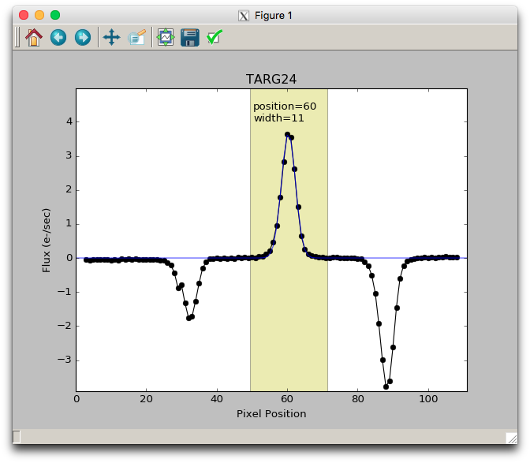
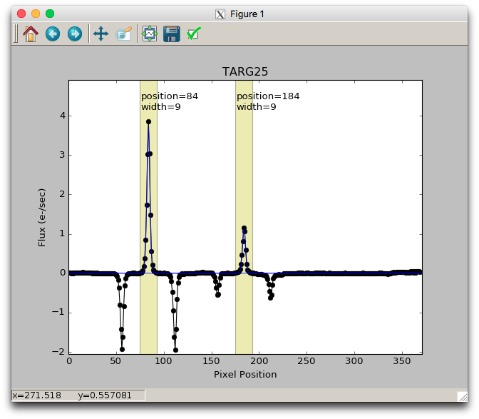

The final step is to extract a 1D spectrum for each object in each slit.  The final line of the `Driver.py` (or equivalent) file will looks something like this:

```
Extract.extract_spectra(maskname, band, interactive=(not bypassflag))
```

This will iterate through all the slits for this mask-band combination and if the interactive flag is set, then it will show a plot of the spatial profile of each slit (collapsed in the spectral direction).  By default, the software will make a guess at one aperture for each slit.  The apertures are indicated by a yellow shaded region and their center position and half width in pixels is annotated near the top of each shaded region.



The apertures define the pixels which will be used as input to the optimal spectral extraction (Horne 1986) algorithm.  Having wide a wide aperture should not add additional noise as that will be optimized during the spectral extraction step.  The apertures are shown here in order for the user to verify 1) that there is no overlap between adjacent objects, 2) that the apertures are wide enough to reasonably encompass all flux from the object, and 3) that all objects have properly defined apertures.

The user can add, modify, or delete apertures interactively using this plot window.

To delete an existing aperture: place the mouse near the center of the aperture and press the "d" key.

To add an aperture by fitting a gaussian to the profile: place the mouse near the peak of the profile and press the "g" key.  The half width of the aperture will be set at 5 times the sigma of the fitted gaussian.



To add an aperture manually: place the mouse in the X position where the new aperture should be centered and press the "a" key.  Then type the half width (in pixels) for that aperture in response to the query in the terminal.

To modify the half width of an existing aperture: place the mouse near the center of the aperture and press the "w" key.  Then type the half width (in pixels) for that aperture in response to the query in the terminal.

To modify the center position of an existing aperture: place the mouse near the center of the aperture and press the "p" key.  Then type the position (in pixels) for that aperture in response to the query in the terminal.

When you are done adding or removing apertures, close the interactive plot window by clicking the close button in the upper right corner (or by whatever method is typical for your OS or windowing system) or press the "q" or "n" keys (for "quit" or "next" respectively).
