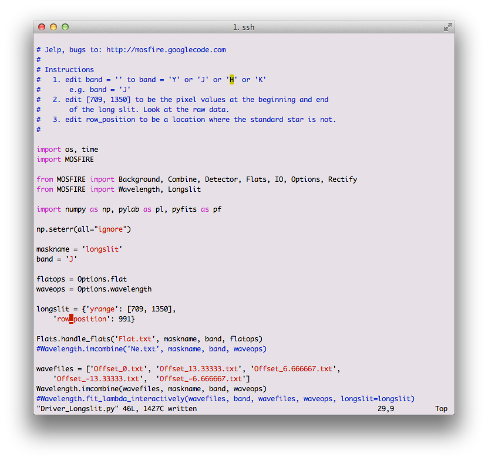

The longslit reductions require transferring the Longslit_Driver.py file into the reduction directory. A few key parameters have to be adjusted in Longslit_Driver.py to help the pipeline figure out where to extract the longslit from. 

* `cd /path/to/LONGSLIT/`
* `cp ~/MosfireDRP-master/drivers/Longslit_driver.py .`
* Check all the .txt files to make sure your observations are included. You may have to merge files from various LONGSLIT* directories. This happens when your observations use a shorter longslit than the calibrations. 
* Note that mospy handle generates separate offset files for each of your targets, using the target name, but does NOT separate repeated observations of the same targets at different times of the night.
* edit `Driver_Longslit.py`
    * Examine a longslit image (see figure below) and adjust 'yrange': [709, 1350] to the vertical range covered by the slit
    * From the same examined longslit, select ‘row_position’ so that it is uncontaminated by the spectrum. See Figure 1.
    * make sure that ‘mode’:’longslit’ is specified in the longslit variable
    * The result should look like Figure 2.
* For each step in a section, uncomment the necessary line and run mosdrp on the Driver file. Once the apply_lambda_simple step is complete, fill in the 'lambda_solution_wave_stack_...' line with the correct wave stack file.

You now have two options based on the results. If the night sky lines are not bright enough to identify in the interactive step you should use arclamps. In the following instructions, replace wavefiles with ‘Ne.txt’ or ‘Ar.txt’ and specify neon=True or argon=True.

 in the longslit.")

An example of an uncontaminated row (#1127) in the longslit.

Example of a modified Driver_Longslit.py. Notice that pixel 991 is selected as the row to perform the initial wavelength solution on. In Figure 2, this is the equivalent of 1127.  