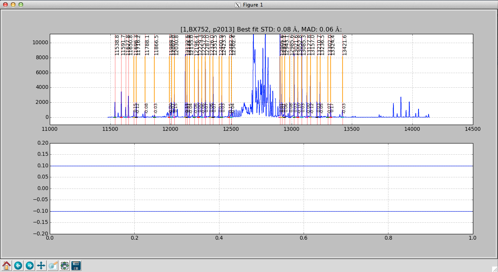

# Wavelength Calibration (Y, J, H)

In the shorter wavebands, when using the recommended exposure times, the wavelength calibration is performed on night sky lines. The mospy Wavelength module is responsbile for these operations. See the example driver file in section 7.

## Combine files

First step is to produce a file with which you will train your wavelength solution. Since we’re using night sky lines for training, the approach is to combine individual science exposures. This is performed by the python Wavelength.imcombine routine. For a lot of users, this will look something like in the Driver.py file:

    Wavelength.imcombine(obsfiles, maskname, band, waveops)

The first parameter is obsfiles which is a python string array indicating the list of files in the offset positions. Note that obsfiles has defaults of “Offset_1.5.txt” and “Offset_-1.5.txt” and may need to be updated as described in section 6. 

Suppose you want to exclude a file for reasons such as weather or telescope fault, simply remove the offending file from the appropriate Offset_*.txt. Likewise, you are welcome to add files in as you like, such as observations from the previous night.

Outputs of this step are:

| Filename                         | Contains                                                                    |
|----------------------------------|-----------------------------------------------------------------------------|
| `wave_stack_[band]_[range].fits` | A median-combined image of the files to be used for the wavelength solution.|

## Interactive wavelength fitting

The next step is to use the wave_stack_*.fits file and determine an initial wavelength solution for each slit. During this process, we interactively fit the lines using a gui that displays. To initiate this process, uncomment the line in the Driver.py file:

    #Wavelength.fit_lambda(maskname, band, obsfiles, obsfiles, waveops)

And then re-execute the driver file: 

    mospy Driver.py 

when you run this step, a GUI window appears.

The interactive wavelength solving window. This is a J-band night sky spectrum.

The interactive wavelength solving window showing an initial fit. This is a J-band night sky spectrum and one of the night sky lines on the right hand side is clearly a poor fit compared to the rest of the identified lines.

The interactive wavelength solving window showing a good fit with the initial poor line removed from the calculation. 
The interactive wavelength solving window showing an initial fit. This is a J-band night sky spectrum and one of the night sky lines on the right hand side is clearly a poor fit compared to the rest of the identified lines.

Plotted in the gui will be a sky line spectrum and vertical lines denoting positions and wavelengths of the sky lines. Your goal is to help the pipeline by identifying the night sky lines in the center of each slit. Once you come up with a good solution in the center, the pipeline will propagate it spatially along the slit. In the gui, Press ? to see a list of commands in the console window. The list of commands available on the GUI are:

* c - to center on the nearest peak (first thing to do to shift the initial wavelength guess) 
* c - Center the nearest line at the cursor position 
* \ - Fit fit the data
* f – Alternate way to fit the data, equivalent to \ but may cause the spectrum to become full screen.
* k – Toggles k-sigma clipping on and off. Also performs a new fit.
* b -  Turns on bypass mode. From now on, the interactive window is not displayed and the fit continues automatically.
* d - Delete a point (remove the wackadoos) 
* n - proceed to the Next object 
* p - return to back to the Previous object 
* r - Reset the current slit (try this if the plot looks strange) 
* z - Zoom at cursor position 
* x - Unzoom: full screen 
* s - Save figure to disk 
* h - Help 
* q - Quit and save results 

Below is a rough procedure for completing the interactive fitting process. The steps you need to take are as follows. 

* First, check to see if the orange lines match up with obvious night sky lines. If not the expected position does not match the actually position of the line do the following:
    * Place your cursor over a line
    * Press the “c’ button that will shift the predicted position to the observed line. 
* Press “f” to fit. An initial fit is done automatically (starting with version 2015A) A Chebyshev polynomial, f, such that f(pixel #) returns the wavelength in Angstroms.
* You can chose to use k-sigma clipping to avoid the manual operation of removing bad lines with the “k” key. 
* Press "x" to unzoom to the full size region
* Assess the fit:
    * If a line is poorly fit and should be removed
        * Move the cursor to the line
        * Press “d” to delete the line from the fit
    * For good fits, the residual points turn green.
* When the satisfied with the fit, press “n” to move to the next object.
* If you want to disable the interactive fit and switch to the automatic fit, press “b” (bypass)
* Repeat the process above until you see the red Done! text in the center of your screen. 
* Press “q” to quit the interactive gui and move to the next step.

The prompt should return following the fitting process. The outputs from this process are:

| Filename              | Contains                                                                                       |
|-----------------------|------------------------------------------------------------------------------------------------|
| `barset.npy`          | bar positions for each slit are specified                                                      |
| `lambda_center_coeffs_wave_stack_band_filenames.npy` | The coefficients of the fit and positions of the measured lines.|

## Wavelength fitting for the entire slit

The next step in the wavelength fitting process is to propogate the solution spatially along each slit. To complete this process we uncomment the line in the Driver.py file:  

    #Wavelength.fit_lambda(maskname, band, obsfiles, obsfiles, waveops)

This is one of the longer running processes and the output should look something like:

    ...
    resid ang S09 @ p 978: 0.10 rms 0.07 mad [shift-22]
    resid ang S09 @ p 979: 0.09 rms 0.06 mad [shift-22]
    resid ang S09 @ p 980: 0.10 rms 0.06 mad [shift-22]
    resid ang S09 @ p 981: 0.09 rms 0.06 mad [shift-22]
    resid ang S09 @ p 982: 0.08 rms 0.05 mad [shift-22]
    resid ang S09 @ p 983: 0.08 rms 0.04 mad [shift-22]
    ...

The prompt should return following the fitting process. The outputs from this process are:

| Filename              | Contains                                                                           |
|-----------------------|------------------------------------------------------------------------------------|
| `lambda_coeffs_wave_stack_J_m130114_0443-0445.npy` | coefficients of the fit for each row within the slit  |

## Apply the wavelength solution

The last step in the wavelength fitting process is to apply the solution and create maps of the wavelength for the data set. To complete this process we uncomment the line in the Driver.py file:  

      #Wavelength.apply_lambda_simple(maskname, band, obsfiles, waveops)

The prompt should return following the fitting process. The outputs from this process are:

| Filename              | Contains                                                                           |
|-----------------------|------------------------------------------------------------------------------------|
| `lambda_solution_wave_stack_J_m130114_0443-0445.fits` | contains a map of the wavelength for each pixel in the spectra  |
| `sigs_solution_wave_stack_J_m130114_0443-0445.fits`   | contains the uncertainty in the measured wavelength position for each pixel in the spectra |
| `rectified_wave_stack_J_m130114_0443-0445.fits`       | contains the spatially and wavelength rectified resampled sky emission. A column in the image contains all pixels at the same wavelength.|

