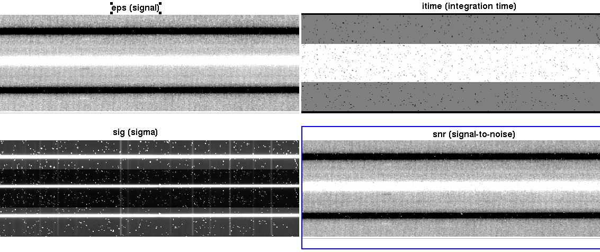
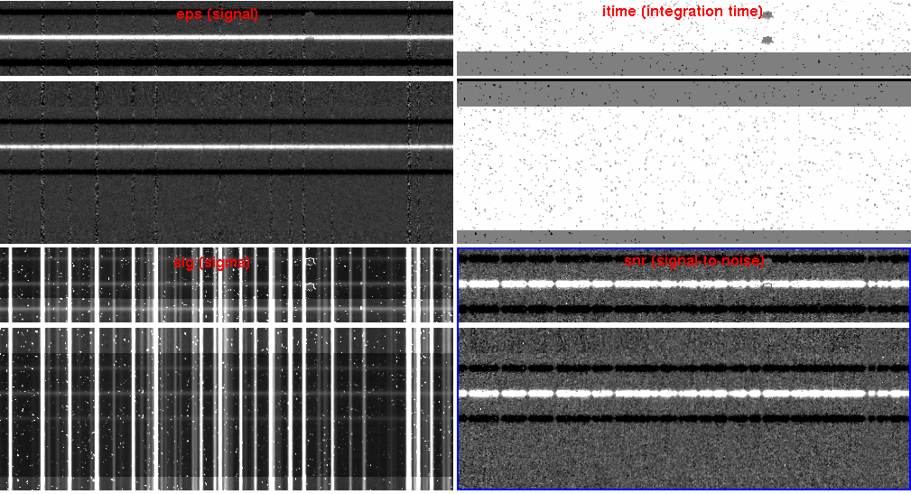
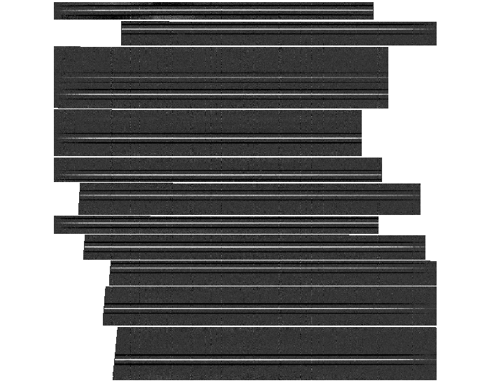

# Examples of Running the Pipeline

Here we demonstrate three walkthroughs of how to run the MOSFIRE pipeline. We include a longslit reduction, a slitmask reduction, and a long2pos reduction in the H and K bands. Example datasets can be downloaded from this link [include link], and includes all three data types. Details of each step in the reduction process can be seen in the manual, so please read the previous sections in the manual to understand the reductions being performed on these data.

## Getting Started

After downloading and unzipping all of the test data, make a directory in your preferred location to perform your reduction and run handle.

    mkdir reduced
    cd reduced
    mospy handle /path/to/data/test_dataset/*.fits
	
You should see five new directories after handle is done.
	
	LONGSLIT-3x0.7 <-- Longslit observations
	LONGSLIT-46x0.7 <-- Longslit calibrations
	MOSFIRE_DRP_MASK <-- Slitmask calibrations and observations
	long2pos <-- long2pos calibrations
	long2pos_specphot <-- long2pos_specphot observations

## Longslit Reduction

For more information on the reduction of longslits, go to the Longslit[link] section.

Move to the Longslit observation directory and copy the calibrations to the observation directory:

	cd LONGSLIT-3x0.7/2012nov28/K
	cp ../../../LONGSLIT-46x0.7/2013oct15/K/*.txt ./
	
Run the autodriver to create the driver file Longslit_HIP17971.py

Edit the driver file so the y-range so it covers the range of the slit, and 'row_position' is not contaminated with the spectrum (you only want sky lines). Look at the files in Offset_-5_HIP17971.txt and Offset_5_HIP17971.txt to determine where these values should be.

Run the pipeline using:

	mospy Longslit_HIP17971.py
	
You can run step by step by commenting out reduction steps in the driver file, or you can run all at once. First the pipeline will create a flat field, as described in the Flats section. Check out your combined and pixel flats to make sure they look reasonable, no odd edges to slits.
	
We do not recommend non-interactive wavelength reductions unless you have a previous reliable wavelength solution in the same directory ("lambda_coeffs_wave_stack..."). Refer to the Wavelength Calibration sections (for H,J, and Y, or K band) for information on how to perform the interactive fit. In this case, we will be performing a K band solution, so check that section for more details.

After rectification, the output (notably, HIP17971_K_eps.fits, HIP17971_K_itime.fits, HIP17971_K_sig.fits, HIP17971_K_snrs.fits) you get should look like this:

For longslits with bright continuua (such as in this example), a spectral extraction if you should wish to perform one will be very simple. In the case of a bright continuum like this, you may or may not choose to perform the aperture selection manually, but we encourage manual control of the apertures whenever reasonable, even if just to check the aperture is correct.

## Slitmask Reduction

Move to the MOSFIRE_DRP_MASK directory and run the autodriver:

	cd MOSFIRE_DRP_MASK/2012sep10/H/
	mospy AutoDriver
	
The driver file will be called Driver.py. Open the file to make sure there are no abnormalities, and proceed to call Driver.py with either the full reduction, or step by step.

	mospy Driver.py
	
Again, we recommend a manual wavelength solution. Once the wavelength solution is propogated, we recommend checking the wavelength propagation by opening lambda_solution_wave_stack_H_m120910_0163-0176.fits to check that no slits are missing and as you check the intensity levels (which will be the wavelength values) for reasonable numbers for your filter (H band in this case).

After rectification, the output whole masks will look like this:

And the entire mask (zoomed out) will look like this:

Even with bright continuua like this slitmask has, we recommend manually controlling the apertures in case secondary objects are in the slits. In the case of faint or emission line only objects, it might be necessary to manually enter where an aperture should be located and the width of the extraction.

## Long2pos_specphot Reduction

Move to the long2pos_specphot directory. Since calibrations for long2pos can be used for long2pos_specphot, copy those calibration files to your long2pos_specphot directory:

	cd long2pos_specphot/2017sep10/K
	cp ../../../long2pos/2017sep29/K/*.txt ./
	
Run the autodriver and open its output, Long2pos_ZW_TEL.py

Either comment out or copy the extract command for each desired output target (positions A or C, wide or narrow). Then run the driver file step by step or as a full reduction.

After rectification, your output eps files for PosA and PosC narrow and wide will look like this:

