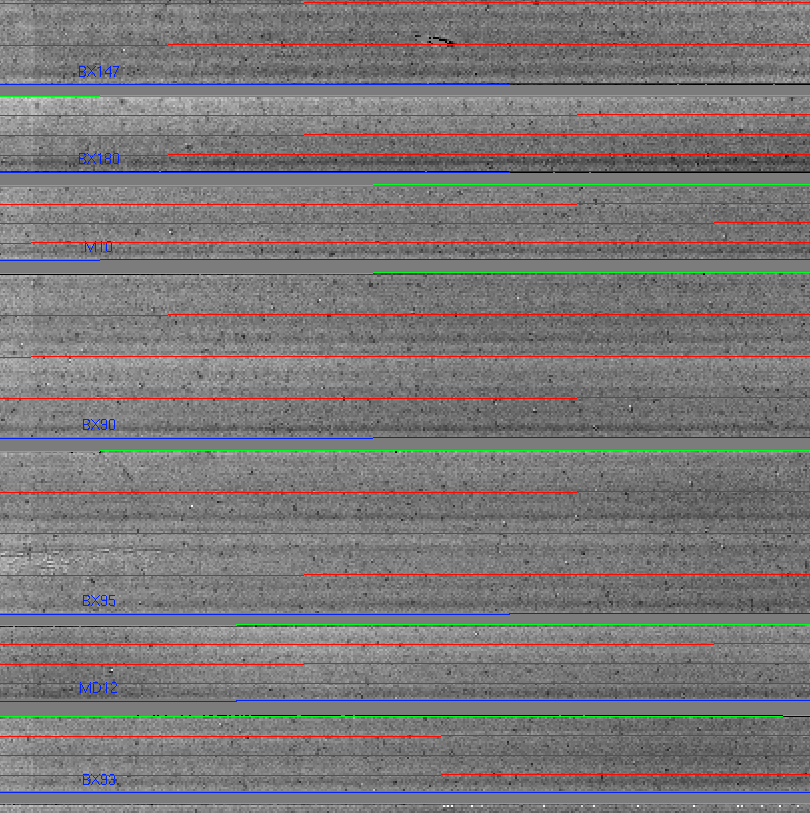

# Flats

The first action the driver file will take is to generate a pixel flat and slit edge tracing. To initiate the flat generation, uncomment the line below in the 
Driver.py file: 

    #Flats.handle_flats('Flat.txt', maskname, band, flatops)

and in your xterm run the DRP 

    > mospy Driver.py 

Example output from the xterm session

    > mospy Driver.py
    ... Truncated output ...
    Flat written to combflat_2d_H.fits
    
    00] Finding Slit Edges for BX113 ending at 1901. Slit composed of 3 CSU slits
    01] Finding Slit Edges for BX129 ending at 1812. Slit composed of 2 CSU slits
    02] Finding Slit Edges for xS15 ending at 1768. Slit composed of 1 CSU slits
    Skipping (wavelength pixel): 10
    03] Finding Slit Edges for BX131 ending at 1680. Slit composed of 2 CSU slits

The slit names output to the screen should look familiar as they originated from the mask design process. The output files from this process are the following:

| Filename              | Contains                                                                                      |
|-----------------------|-----------------------------------------------------------------------------------------------|
| `combflat_2d_J.fits`  | FITS image of the flats                                                                       |
| `flatcombine.lst`     | The list of files used in the creation of the flat. Contains the full path name to the files. |
| `pixelflat_2d_J.fits` | FITS image of the normalized flat. This is the flat used in other redution steps.             |
| `slit-edges_J.npy`    | File containing the slit edge information                                                     |
| `slit-edges_J.reg`    | DS9 regions file that may be overlayed to show the locations of the slits.                    |

At the end, check the output in ds9. For example:

    > ds9 pixelflat_2d_H.fits -region slit-edges_H.reg

The regions file overlayed on the pixelflat image should look something like:

The green lines must trace the edge of the slit. If they don’t, then the flat step failed. All values should be around 1.0. There are some big features in the detector that you will become familiar with over time.

## K-band flats

At K-band, the dome is hot enough that light is detected at the longest wavelengths at a level of a few hundred counts. Little to no light is seen at the shortest wavelengths. The light from the dome is not entering MOSFIRE at the same angles that the light from the spot illuminated on the dome by the dome lights. Some observers may wish to correct for this difference by subtracting the thermal flat emission from the dome flat emission before normalizing the flats. To complete this flat subtraction, you use the optional keyword lampsofflist in the flat process as seen in the command below:

    Flats.handle_flats('Flat.txt', maskname, band, flatops, lampOffList='FlatThermal.txt')                                                                      

If thermal flats were included in your calibration sequence (default behavior for K-band), then the FlatThermal.txt file should be populated with a list of thermal flats. Use FlatThermal.txt as the list or modify it as you see necessary.

The outputs from the flat process will include two additional files. 

* combflat_lamps_off_2d_K.fits
* combflat_lamps_on_2d_K.fits

and now the combflat_2d_K.fits being the difference between the two files.
